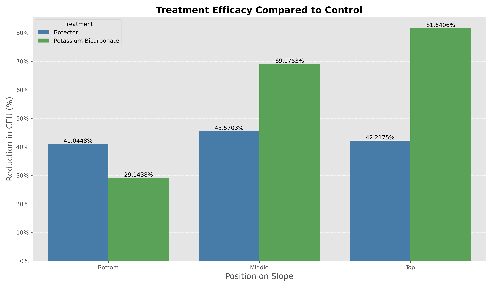

# Colony-Forming Unit (CFU) Analysis Report

## Overview

This analysis examines the effects of three treatments (Control, Botector, and Potassium Bicarbonate) across three positions on a slope (Top, Middle, Bottom) on Colony-Forming Unit (CFU) counts. The goal is to determine if there are significant differences between treatments and if position on the slope affects CFU counts.

### Experimental Context

Colony-Forming Units (CFUs) are a measure of viable fungal or bacterial cells in a sample. In this experiment, three treatments were applied across three positions on a slope:

- **Treatments**: Control (no treatment), Botector (a biological control agent), and Potassium Bicarbonate (a chemical fungicide)
- **Positions**: Top, Middle, and Bottom of slope
- **Replication**: Each treatment-position combination was replicated three times, with five measurements taken per replicate

## Summary Statistics

The table below presents key summary statistics for each combination of treatment and position:

```
| Treatment             | Position   |   count |     mean |     std |   min |   max |     sem |      cv |   efficacy |
|:----------------------|:-----------|--------:|---------:|--------:|------:|------:|--------:|--------:|-----------:|
| Botector              | Bottom     |      15 | 100.0667 | 18.4370 |    68 |   134 |  4.7604 | 18.4247 |    41.0448 |
| Botector              | Middle     |      15 | 131.0667 | 40.6316 |    86 |   197 | 10.4910 | 31.0007 |    45.5703 |
| Botector              | Top        |      15 | 128.2000 | 48.9259 |    60 |   222 | 12.6326 | 38.1637 |    42.2175 |
| Control               | Bottom     |      15 | 169.7333 | 45.5121 |    85 |   256 | 11.7512 | 26.8139 |   nan      |
| Control               | Middle     |      15 | 240.8000 | 66.0619 |   158 |   433 | 17.0571 | 27.4343 |   nan      |
| Control               | Top        |      15 | 221.8667 | 65.1228 |   156 |   345 | 16.8146 | 29.3522 |   nan      |
| Potassium Bicarbonate | Bottom     |      15 | 120.2667 | 20.8788 |    87 |   167 |  5.3909 | 17.3604 |    29.1438 |
| Potassium Bicarbonate | Middle     |      15 |  74.4667 | 42.6596 |    21 |   146 | 11.0147 | 57.2868 |    69.0753 |
| Potassium Bicarbonate | Top        |      15 |  40.7333 | 12.7362 |    16 |    65 |  3.2885 | 31.2671 |    81.6406 |
```

*Note: 'count' represents number of measurements, 'mean' and 'std' are average and standard deviation of CFU counts, 'sem' is standard error of mean, 'cv' is coefficient of variation (%), and 'efficacy' shows percent reduction compared to control.*

## Statistical Analysis

Before conducting the main analysis, we need to check if our data meets the necessary assumptions for parametric testing.

### Assumptions Testing

#### Normality Test (Shapiro-Wilk)

The Shapiro-Wilk test examines whether data follows a normal distribution. This is important because Analysis of Variance (ANOVA) assumes that the data within each group is normally distributed.

- **W statistic**: Values closer to 1 indicate normality
- **p-value**: If p > 0.05, we cannot reject the assumption of normality
- **Interpretation**: Data is considered normally distributed when p > 0.05

```
| Treatment_Position           |      W |      p | Normal   |
|:-----------------------------|-------:|-------:|:---------|
| Control_Top                  | 0.8282 | 0.0087 | False    |
| Control_Middle               | 0.8448 | 0.0147 | False    |
| Control_Bottom               | 0.9720 | 0.8863 | True     |
| Botector_Top                 | 0.9301 | 0.2738 | True     |
| Botector_Middle              | 0.8160 | 0.0059 | False    |
| Botector_Bottom              | 0.9807 | 0.9743 | True     |
| Potassium Bicarbonate_Top    | 0.9809 | 0.9754 | True     |
| Potassium Bicarbonate_Middle | 0.9203 | 0.1949 | True     |
| Potassium Bicarbonate_Bottom | 0.9558 | 0.6207 | True     |
```

#### Homogeneity of Variance (Levene's Test)

Levene's test examines whether the different groups have similar variances. ANOVA assumes that all groups have similar spread of data.

- **Test statistic**: 2.8600
- **p-value**: 0.0059
- **Equal variance assumption**: Not met
- **Interpretation**: Since p < 0.05, the groups have different variances, violating this ANOVA assumption. Results should be interpreted with caution.

### Two-Way ANOVA Results

**What is ANOVA?** Analysis of Variance (ANOVA) is a statistical method used to compare means of multiple groups. In this case, we're using a two-way ANOVA because we have two factors: Treatment and Position. This analysis helps us understand:

1. **Main effect of Treatment**: Does the type of treatment (Control, Botector, or Potassium Bicarbonate) significantly affect CFU counts, regardless of position?
2. **Main effect of Position**: Does the position on the slope (Top, Middle, or Bottom) significantly affect CFU counts, regardless of treatment?
3. **Interaction effect**: Do treatments behave differently depending on position? For example, does Botector work better at the Top position compared to other positions?

**How to interpret the results**:
- The **sum_sq** column shows the sum of squares, or variation explained by each factor
- The **F** value is the test statistic - higher values indicate a stronger effect
- The **PR(>F)** column shows the p-value - values less than 0.05 indicate statistical significance

```
|                          |   sum_sq |   df |        F |   PR(>F) |
|:-------------------------|---------:|-----:|---------:|---------:|
| C(Treatment)             | 412441   |    2 | 106.183  |   0      |
| C(Position)              |  10417.4 |    2 |   2.682  |   0.0723 |
| C(Treatment):C(Position) |  86825.9 |    4 |  11.1767 |   0      |
| Residual                 | 244707   |  126 | nan      | nan      |
```

#### Key Findings from ANOVA:
- **Treatment effect**: Significant (p = 0.0000) - This means that the different treatments do have significantly different effects on CFU counts.
- **Position effect**: Not significant (p = 0.0723) - This means that the position on the slope does not significantly affect CFU counts.
- **Interaction effect**: Significant (p = 0.0000) - This means that the effect of treatments depends on the position on the slope. In other words, some treatments may work better at certain positions than others.

### Post-hoc Tests

When ANOVA indicates significant differences, we need to perform follow-up tests to determine exactly which groups differ from each other. This is where Tukey's Honest Significant Difference (HSD) test comes in.

#### Tukey's HSD for Treatment Factor

**What is Tukey's HSD?** This test compares all possible pairs of treatments to identify which specific treatments differ significantly from each other. It controls for the increased risk of false positives when making multiple comparisons.

**How to interpret the results**:
- **A** and **B** columns show which treatments are being compared
- **mean(A)** and **mean(B)** show the average CFU counts for each treatment
- **diff** shows the difference between these means
- **p-tukey** is the adjusted p-value - values less than 0.05 indicate a significant difference
- **hedges** is an effect size measure

```
| A        | B                     |   mean(A) |   mean(B) |     diff |      se |       T |   p-tukey |   hedges |
|:---------|:----------------------|----------:|----------:|---------:|--------:|--------:|----------:|---------:|
| Botector | Control               |  119.7778 |  210.8000 | -91.0222 | 10.7301 | -8.4829 |    0.0000 |  -1.6593 |
| Botector | Potassium Bicarbonate |  119.7778 |   78.4889 |  41.2889 | 10.7301 |  3.8480 |    0.0005 |   0.9855 |
| Control  | Potassium Bicarbonate |  210.8000 |   78.4889 | 132.3111 | 10.7301 | 12.3309 |    0.0000 |   2.3606 |
```

#### Tukey's HSD for Position Factor

Similar to the treatment comparison, this test identifies which specific positions (Top, Middle, Bottom) differ significantly from each other in terms of CFU counts.

```
| A      | B      |   mean(A) |   mean(B) |     diff |      se |       T |   p-tukey |   hedges |
|:-------|:-------|----------:|----------:|---------:|--------:|--------:|----------:|---------:|
| Bottom | Middle |  130.0222 |  148.7778 | -18.7556 | 15.8271 | -1.1850 |    0.4642 |  -0.2749 |
| Bottom | Top    |  130.0222 |  130.2667 |  -0.2444 | 15.8271 | -0.0154 |    0.9999 |  -0.0035 |
| Middle | Top    |  148.7778 |  130.2667 |  18.5111 | 15.8271 |  1.1696 |    0.4734 |   0.2110 |
```

#### Treatment Comparison Within Each Position

Since we're also interested in how treatments perform at each specific position, these tests compare treatments separately within each position group. This helps us understand if, for example, Botector is particularly effective at the Top position but not at others.

```
| A        | B                     |   mean(A) |   mean(B) |      diff |      se |       T |   p-tukey |   hedges | Position   |
|:---------|:----------------------|----------:|----------:|----------:|--------:|--------:|----------:|---------:|:-----------|
| Botector | Control               |  128.2000 |  221.8667 |  -93.6667 | 17.3806 | -5.3891 |    0.0000 |  -1.5823 | Top        |
| Botector | Potassium Bicarbonate |  128.2000 |   40.7333 |   87.4667 | 17.3806 |  5.0324 |    0.0000 |   2.3806 | Top        |
| Control  | Potassium Bicarbonate |  221.8667 |   40.7333 |  181.1333 | 17.3806 | 10.4216 |    0.0000 |   3.7560 | Top        |
| Botector | Control               |  131.0667 |  240.8000 | -109.7333 | 18.6606 | -5.8805 |    0.0000 |  -1.9469 | Middle     |
| Botector | Potassium Bicarbonate |  131.0667 |   74.4667 |   56.6000 | 18.6606 |  3.0331 |    0.0113 |   1.3220 | Middle     |
| Control  | Potassium Bicarbonate |  240.8000 |   74.4667 |  166.3333 | 18.6606 |  8.9136 |    0.0000 |   2.9104 | Middle     |
| Botector | Control               |  100.0667 |  169.7333 |  -69.6667 | 11.2491 | -6.1931 |    0.0000 |  -1.9522 | Bottom     |
| Botector | Potassium Bicarbonate |  100.0667 |  120.2667 |  -20.2000 | 11.2491 | -1.7957 |    0.1834 |  -0.9979 | Bottom     |
| Control  | Potassium Bicarbonate |  169.7333 |  120.2667 |   49.4667 | 11.2491 |  4.3974 |    0.0002 |   1.3593 | Bottom     |
```

## Visualizations

Each visualization presents a different perspective on the data to help understand the relationships between treatments and positions.

### 1. Enhanced Box Plot with Individual Data Points


**What this shows:** This plot displays the distribution of CFU counts for each treatment across the three positions on the slope. 

**How to interpret:**
- The colored boxes show the interquartile range (middle 50% of data) for each treatment
- The horizontal line inside each box represents the median value
- The "whiskers" extend to the minimum and maximum values (excluding outliers)
- Individual points represent actual measurements, allowing you to see the raw data
- The x-axis groups data by position (Top, Middle, Bottom), with different colors representing the three treatments

**Key insights:** This visualization helps identify differences in both the central tendency and the spread of CFU counts across treatments and positions, while showing the actual data points.

### 2. Grouped Bar Plot


**What this shows:** This plot presents the mean CFU counts for each treatment at each position, with error bars indicating standard error of the mean.

**How to interpret:**
- Each position (Top, Middle, Bottom) has three bars representing the three treatments
- The height of each bar represents the mean CFU count
- Error bars show the standard error, giving an indication of the reliability of the mean
- Different colors distinguish between the three treatments

**Key insights:** This visualization clearly shows the average performance of each treatment at each position, making it easy to compare treatment efficacy across positions.

### 3. Heat Map of CFU Counts


**What this shows:** This heat map uses color intensity to visualize mean CFU counts for each treatment-position combination.

**How to interpret:**
- Rows represent positions on the slope
- Columns represent treatments
- Color intensity corresponds to CFU count (darker red = higher count)
- The numbers in each cell show the exact mean CFU count

**Key insights:** Heat maps provide a quick visual overview of which treatment-position combinations have the highest and lowest CFU counts, making patterns easier to spot.

### 4. Violin Plot


**What this shows:** Violin plots combine aspects of box plots with density plots to show the distribution of CFU counts.

**How to interpret:**
- The width of each "violin" at any point represents the density of data at that CFU count
- Wider sections indicate more data points at that CFU value
- Inside each violin is a small box plot showing median and interquartile range
- The x-axis groups by position, with colors distinguishing treatments

**Key insights:** This visualization reveals the full distribution shape of each dataset, showing whether CFU counts are concentrated in certain ranges or more evenly distributed.

### 5. Treatment Efficacy Compared to Control


**What this shows:** This bar chart displays the percentage reduction in CFU counts for each treatment compared to the control at each position.

**How to interpret:**
- The x-axis shows the three positions
- The y-axis shows percent reduction in CFU counts compared to the control
- Higher percentages indicate greater efficacy (more reduction in CFUs)
- Different colors distinguish between treatments
- The percentage values are labeled on each bar

**Key insights:** This visualization directly shows how effective each treatment is at reducing CFU counts compared to the control at each position on the slope.

### 6. Enhanced Interaction Plot


**What this shows:** This interaction plot illustrates how the effect of treatments varies across positions.

**How to interpret:**
- The x-axis represents position on the slope
- The y-axis shows mean CFU counts
- Each line represents a different treatment
- Non-parallel lines indicate an interaction effect (the treatment effect varies by position)

**Key insights:** This visualization helps identify if treatments perform consistently across positions or if their effectiveness depends on position. When lines cross or have very different slopes, it suggests that position affects how well a treatment works.

## Conclusion

The analysis reveals a significant effect of treatment on CFU counts. The Botector and Control treatments differ significantly (p = 0.0000). The Botector and Potassium Bicarbonate treatments differ significantly (p = 0.0005). The Control and Potassium Bicarbonate treatments differ significantly (p = 0.0000). The position on the slope did not significantly affect CFU counts. The significant interaction between treatment and position indicates that the effect of treatments varies depending on the position on the slope.

Overall, Botector reduced CFU counts by 43.1794% and Potassium Bicarbonate by 62.7662% compared to the Control treatment.